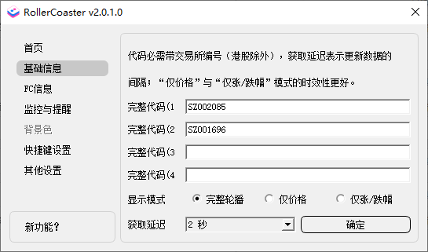
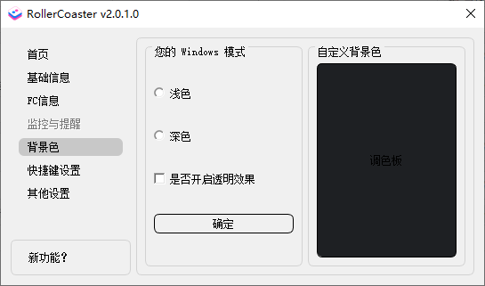

# RollerCoaster

[中文说明看这里](./README_zh.md)

### What's this?

Monitor real-time price changes through the stock code and place it on the desktop taskbar, a must-have for fishing. The shortest monitoring interval is 2 seconds; the maximum number of monitoring is 4; the color distinguishes the rise and fall; with system global shortcut keys; with market tracking reminder.

### What can you do?

- Use the stock code to monitor real-time price changes, and monitor one quantity (the code must be entered completely, such as: SZ002594)
- Monitoring interval, minimum 2 seconds, default 3 seconds
- The number of monitors, before version `v1.0.3`, can only support one, `v1.0.3` and after is a maximum of two, `v1.1.0.0` and after is a maximum of four.
- If it rises, the font will be `red`. If it falls, the font will be `green`
- Added that the price will no longer be obtained after the market closes (15:00). Before the market opens, the time will be checked every 1 minute and the price will be obtained at the set time (9:00). [Note: This item relies heavily on the local time of the computer, please ensure that the time is accurate]
- Added version update prompt (requires version greater than or equal to `1.0.4.5`). If there is a new version, you will see a `little red dot` prompt after opening the settings page.
- Added disk tracking reminder (requires version greater than or equal to `v1.1.0.0`), you can choose to turn it on or off
- Added display mode selection (requires version greater than or equal to `v1.1.0.0`), you can choose `full carousel, only price, only increase and decrease`, among which `only price, only increase and decrease` is more timely

### How to use it?

- Download the distribution version `exe` installation program (may report viruses), and install and start it
- Right-click the icon in the system tray>Settings>Basic Settings> and select the delay interval. After entering it, click OK
- In the system tray, right-click the icon and exit, the program will exit.
- Double-click the icon in the system tray to switch between hiding/showing data
- Other settings: background color, shortcut keys, monitoring and reminder settings, update source selection

### Some screenshots

1. Run the display effect

    

2. Code settings

    

3. Monitoring and reminder settings

    

4. Background color setting

    

5. Shortcut key settings

    

6. New features?

   

### License

[Using GPL-3.0 license](https://www.gnu.org/licenses/gpl-3.0.html)