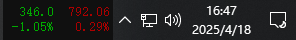
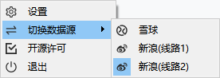

# RollerCoaster

[中文说明看这里](./README_zh.md)

### What's this?

Through stocks and futures codes, monitor real-time price changes and place them on the desktop taskbar, which is a must-have for fishing. The monitoring interval is at least 2 seconds; the number of monitoring is at most 4; the colors distinguish between rise and fall; the system is global shortcut keys; and the disk is monitored.

### What can you do?

- Use the stock code to monitor real-time price changes, listen for 4 numbers, and enter the following rules:
  - **`Note: The mainland exchange must enter complete, Shanghai Stock Exchange (SH), Shenzhen Stock Exchange (SZ), and Beijing Stock Exchange (BJ). For example: SZ002594`**
  - **`Note: The Hong Kong Stock Exchange does not need to add HK, just directly have a stock code`**
- Use futures code to monitor real-time price changes, listen for 4 numbers, and enter the following rules:
  - **`Note: Only internal futures are supported at present.`**
- Listening interval, minimum 2 seconds, default 3 seconds;
- If it rises, the font is `red`. If it falls, the font is `green` (can be reversed);
- After closing (16:00), you do not get the price. Before opening, check the time every 1 minute to get the price at the set time (9:00). [Note: This depends heavily on the computer local time, please make sure the time is accurate]
  - **`Note: In order to adapt to Hong Kong stocks, the closing time here is set to 16:00`**
- Added the `Data source` switching function, currently available `Sina` and `Snowball`.

### How to use it?

- Download the release version `exe` installer (may cause poison) and install it and start it. The default installation of `D disk`
- Right-click icon in the system pallet》Settings》Basic settings》 and select the delay interval. After entering, click OK
- Right-click icon in the system tray > Switch data source > Optional `Sina` and `Snowball`
- Right-click the icon in the system tray to exit, then the program exits
- Double-click the icon in the system tray to switch to hide/show data
- Other settings: background color, shortcut keys, monitoring and reminder settings, update source selection

### What should I pay attention to?

- Increase the number of listeners. Before the version `v1.0.3`, only 1 can be supported, 2 can be supported, and `v1.0.3` and after, `v1.1.0.0` and after, up to 4 can be supported
- Added a new version update prompt (need to be greater than or equal to `1.0.4.5` version). If a new version exists, you will see a `Little Red Dot` prompt after opening the settings page.
- Added a new reminder for watching the disk (need to be greater than or equal to `v1.1.0.0` version), you can choose to turn on or off
- Added display mode selection (need to be greater than or equal to `v1.1.0.0` version), you can choose `full carousel, only price, only increase or decrease, where `` only price, only increase or decrease` has better timeliness

### What problems may be encountered?
- Show the word "错误":
  - Solution: Add `stock.xueqiu.com`,`hq.sinajs.cn` to the proxy whitelist to prevent it from traversing proxy traffic
- Windows 11 does not display:
  - The new solution has been replaced, but the new solution shows a slight flaw compared to the old solution. However, there is no better solution at the moment. The reason is that after the 22H2 version of Windows 11, Microsoft updated the taskbar implementation method, which caused the original implementation method to be incompatible.

### Some screenshots

1. Run display effect (left stock and right period)

    

2. Code settings

    

3. FC code settings
    
    

4. Monitoring and reminder settings (currently only stocks are supported)

    

5. Background color setting

    

6. Shortcut key settings

    

7. Other settings

    

8. New features?

   

9. Switch data source 

   

### License

[Using GPL-3.0 license](https://www.gnu.org/licenses/gpl-3.0.html)