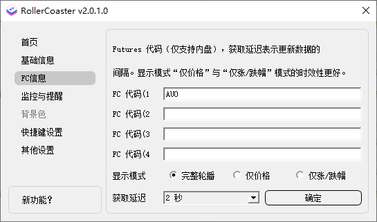
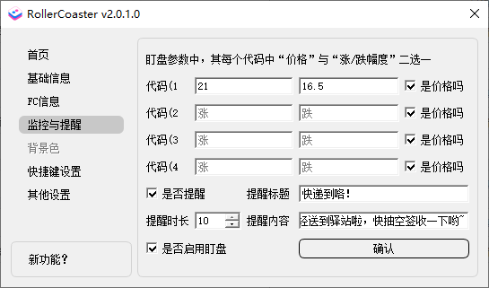

# 过山车

### 这是什么？

通过股票、期货代码，监听实时价格变化，并置于桌面任务栏，摸鱼必备。 监听间隔最短2秒；监听数量最多4个；颜色区分涨跌；带系统全局快捷键；带盯盘提醒。

### 能干什么？

- 用股票代码，监听实时价格变化，监听数量4个,输入规则如下：
  - **`注意：内地交易所必须输入完整，上证(SH)、深证(SZ)、北证(BJ)。如：SZ002594`**
  - **`注意：港交所则不需要加 HK，直接股票代码就行，如：01810`**
- 用期货代码，监听实时价格变化，监听数量4个,输入规则如下：
  - **`注意：当前只支持内盘期货`**
- 监听间隔，最短2秒，默认3秒；
- 若涨，则字体`红色`。若跌，则字体`绿色`(可取反)；
- 收盘后（16:00）不在获取价格，开盘前，每1分钟检查一次时间，到设定时间（9:00）获取价格。【注意：此项严重依赖电脑本地时间，请确保时间准确】
  - **`注意：为了适配港股，这里的收市时间统一设置成了 16:00`**

### 怎么用的？

- 下载发行版`exe`安装程序（可能会报毒），并安装启动，默认安装 `D盘`
- 系统托盘内》右键图标》设置》基础设置》，并选择延迟间隔，输入后，点击确定即可
- 系统托盘内》右键图标》退出，则程序退出
- 系统托盘内》双击图标》切换隐藏/显示数据
- 其他设置：背景色,快捷键,监控与提醒设置,更新源选择

### 需要注意什么？

- 增加监听数量，版本`v1.0.3`之前，只能支持1只，`v1.0.3`及之后为最多2只，`v1.1.0.0`及之后为最多4只
- 新增版本更新提示（需要大于等于`1.0.4.5`版本），若存在新版本，则打开设置页面后，会看到一个`小红点`提示。
- 新增盯盘提醒（需要大于等于`v1.1.0.0`版本），可选择开启或关闭
- 新增显示模式选择（需要大于等于`v1.1.0.0`版本），可选择`完整轮播，仅价格，仅涨跌幅度`,其中`仅价格，仅涨跌幅度`时效性更好

### 可能遇到的问题？

- 显示“错误”字样：
    - 解决办法：将`stock.xueqiu.com`,`hq.sinajs.cn`加入到代理白名单，使其不要走代理流量
- Windows 11 不显示：
    - 目前暂无解决办法。原因是 Windows11 22H2 版本后，微软对任务栏实现方式进行了更新，导致原本实现方式不兼容。

### 部分截图

1. 运行显示效果（左股右期）

   

2. 代码设置

   

3. FC代码设置

   

4. 监控与提醒设置（当前仅支持股）

   

5. 背景色设置

   

6. 快捷键设置

   

7. 新功能？

   

### 许可

[使用 GPL-3.0 license](https://www.gnu.org/licenses/gpl-3.0.html)