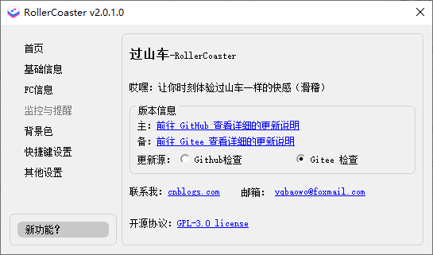

# RollerCoaster

### 这是什么？

通过股票代码，监听实时价格变化，并置于桌面任务栏，摸鱼必备。支持全局快捷键隐藏,全局呼出设置页面。

### 能干什么？

- 用股票代码，监听实时价格变化，监听数量一个（代码必须输入完整，如：SZ002594）
- 监听间隔，最短2秒，默认3秒
- 监听数量，版本`v1.0.3`之前，只能支持一只，`v1.0.3`之后为最多二只
- 若涨，则字体`红色`。若跌，则字体`绿色`
- 新增收盘后（15:00）不在获取价格，开盘前，每1分钟检查一次时间，到设定时间（9:00）获取价格。【注意：此项严重依赖电脑本地时间，请确保时间准确】

### 怎么用的？

- 下载发行版`exe`安装程序，并安装启动
- 系统托盘内》右键图标》设置》基础设置》，并选择延迟间隔，输入后，点击确定即可
- 系统托盘内》右键图标》退出，则程序退出
- 系统托盘内》双击图标》切换隐藏/显示数据
- 其他设置：背景色,快捷键

### 部分截图

1. 运行显示效果

   

2. 代码设置

   
3. 背景色设置

   

4. 快捷键设置

   

5. 新功能？

   

### 许可

[使用 GPL-3.0 license](https://www.gnu.org/licenses/gpl-3.0.html)